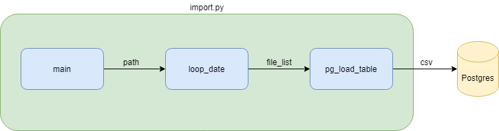

# psycopg2

## Description

psycopg2 is a Python program for loading CSV file to PostgreSQL Database.

## Architecture


## Installation

Use the package manager [pip](https://pip.pypa.io/en/stable/) to install psycopg2.

```bash
pip install psycopg2
```

## Usage

```bash
python import.py
```

## Contributing
Pull requests are welcome. For major changes, please open an issue first to discuss what you would like to change.

Please make sure to update tests as appropriate.

## License
[MIT](https://choosealicense.com/licenses/mit/)
